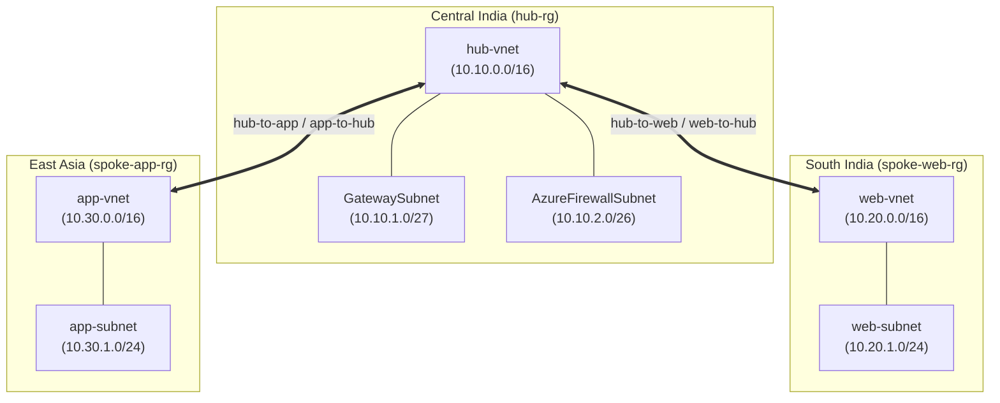
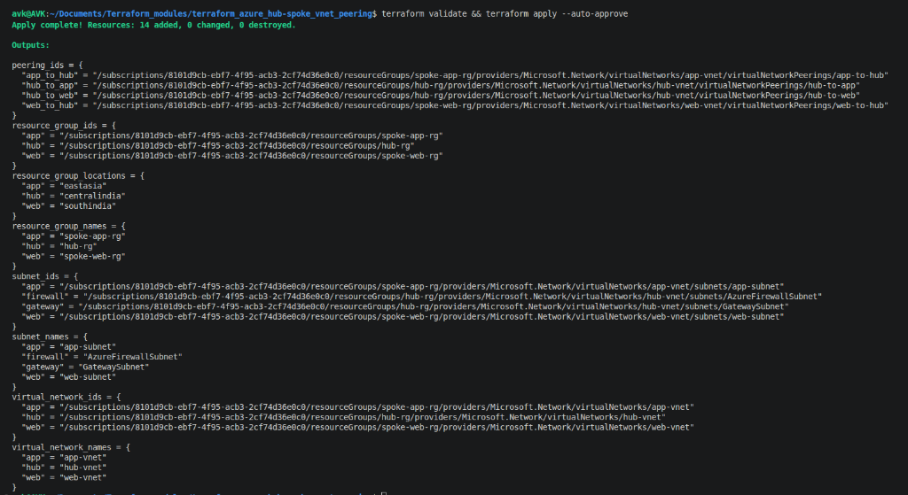
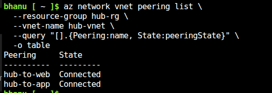

# Azure Hub-Spoke VNet Peering Infrastructure with Terraform

[](https://www.terraform.io/)
[](https://azure.microsoft.com/)
[](https://learn.microsoft.com/en-us/azure/architecture/reference-architectures/hybrid-networking/hub-spoke)

A enterprise-grade, modular Infrastructure as Code (IaC) repository built with **Terraform** to provision a multi-region **Azure Hub-and-Spoke Virtual Network Architecture** with full bidirectional VNet peering.

---

## 📐 Architecture Overview

The Hub-and-Spoke topology centralizes shared network services (such as Azure Firewall and VPN/ExpressRoute Gateways) inside a central **Hub VNet**, while isolating workload environments across multi-region **Spoke VNets** (Web and Application tiers).



### Network Component Breakdown

| Network Component | Resource Group | Region | Address Space / Prefix | Subnets |
| :--- | :--- | :--- | :--- | :--- |
| **Hub Network** | `hub-rg` | `Central India` | `10.10.0.0/16` | `GatewaySubnet` (`10.10.1.0/27`)<br/>`AzureFirewallSubnet` (`10.10.2.0/26`) |
| **Web Spoke** | `spoke-web-rg` | `South India` | `10.20.0.0/16` | `web-subnet` (`10.20.1.0/24`) |
| **App Spoke** | `spoke-app-rg` | `East Asia` | `10.30.0.0/16` | `app-subnet` (`10.30.1.0/24`) |

---

## 📁 Repository Structure

The project is structured using modular Terraform patterns with reusable local submodules:

```text
terraform_azure_hub-spoke_vnet_peering/
├── images/                             # Proof-of-Execution screenshots
│   ├── terraform-apply-output.png
│   └── azure-vnet-peering-status.png
├── modules/                            # Reusable Infrastructure Modules
│   ├── peering/                        # VNet Peering submodule (azurerm_virtual_network_peering)
│   │   ├── main.tf
│   │   ├── outputs.tf
│   │   └── variables.tf
│   ├── resource-group/                 # Resource Group submodule (azurerm_resource_group)
│   │   ├── main.tf
│   │   ├── outputs.tf
│   │   └── variables.tf
│   ├── subnet/                         # Subnet submodule (azurerm_subnet)
│   │   ├── main.tf
│   │   ├── outputs.tf
│   │   └── variables.tf
│   └── vnet/                           # Virtual Network submodule (azurerm_virtual_network)
│       ├── main.tf
│       ├── outputs.tf
│       └── variables.tf
├── main.tf                             # Root module orchestration & submodule calls
├── variables.tf                        # Root input variable definitions
├── outputs.tf                          # Root module output exports
├── terraform.tfvars                    # Environment-specific configuration values
├── provider.tf                         # AzureRM provider configuration
├── versions.tf                         # Terraform & provider version constraints
└── README.md                           # Documentation
```

---

## ✨ Key Features

- **Dynamic Module Provisioning**: Uses Terraform `for_each` map iterations across all submodules to avoid redundant code blocks.
- **Multi-Region Support**: Deploys resource groups and VNets across multiple Azure regions (`Central India`, `South India`, `East Asia`).
- **Bidirectional Peering**: Configures full 2-way peerings (`hub-to-web`, `web-to-hub`, `hub-to-app`, `app-to-hub`) with traffic forwarding enabled (`allow_forwarded_traffic = true`).
- **Subnet Reservation**: Includes required Azure system subnets (`GatewaySubnet`, `AzureFirewallSubnet`) inside the Hub VNet.
- **Clean Output Architecture**: Standardized outputs returning structured maps of Resource IDs, Names, Subnets, and Peering states.

---

## 🚀 Usage & Quick Start

### 1. Prerequisites

Ensure you have the following tools installed and configured:
- [Terraform](https://developer.hashicorp.com/terraform/downloads) `>= 1.5.0`
- [Azure CLI](https://docs.microsoft.com/en-us/cli/azure/install-azure-cli)
- Active Azure Subscription with adequate permissions.

Authenticate to Azure via CLI:
```bash
az login
az account set --subscription "<your-subscription-id>"
```

### 2. Initialize & Validate

Initialize Terraform to download provider plugins and submodules:
```bash
terraform init
```

Format and validate the configuration files:
```bash
terraform fmt -recursive
terraform validate
```

### 3. Review Plan & Deploy

Generate an execution plan to verify resource creation (14 resources total):
```bash
terraform plan
```

Apply the configuration to provision the Azure infrastructure:
```bash
terraform apply --auto-approve
```

---

## 🖼️ Deployment Proof & Verification Outputs

### 1. Terraform Apply Execution

Executing `terraform validate && terraform apply --auto-approve` provisions all 14 resources across Azure regions and prints out detailed IDs and names:



### 2. Azure VNet Peering Status Verification

Verify the peering status of `hub-vnet` using the Azure CLI:
```bash
az network vnet peering list \
  --resource-group hub-rg \
  --vnet-name hub-vnet \
  --query "[].{Peering:name, State:peeringState}" \
  -o table
```

**Output:**



Both peerings (`hub-to-web` and `hub-to-app`) establish an active `Connected` state immediately upon deployment.

---

## 📋 Input Variables Reference

Below are the variables configured in `terraform.tfvars`:

| Variable Name | Description | Type | Default / Value |
| :--- | :--- | :--- | :--- |
| `hub_rg_name` | Name of the Hub Resource Group | `string` | `"hub-rg"` |
| `web_rg_name` | Name of the Web Spoke Resource Group | `string` | `"spoke-web-rg"` |
| `app_rg_name` | Name of the App Spoke Resource Group | `string` | `"spoke-app-rg"` |
| `hub_location` | Azure Region for Hub Resources | `string` | `"Central India"` |
| `web_location` | Azure Region for Web Spoke | `string` | `"South India"` |
| `app_location` | Azure Region for App Spoke | `string` | `"East Asia"` |
| `hub_vnet_name` | Name of the Hub Virtual Network | `string` | `"hub-vnet"` |
| `web_vnet_name` | Name of the Web Spoke Virtual Network | `string` | `"web-vnet"` |
| `app_vnet_name` | Name of the App Spoke Virtual Network | `string` | `"app-vnet"` |
| `hub_vnet_address_space` | Address CIDR for Hub VNet | `list(string)` | `["10.10.0.0/16"]` |
| `web_vnet_address_space` | Address CIDR for Web VNet | `list(string)` | `["10.20.0.0/16"]` |
| `app_vnet_address_space` | Address CIDR for App VNet | `list(string)` | `["10.30.0.0/16"]` |
| `gateway_subnet_prefix` | Address CIDR for GatewaySubnet | `string` | `"10.10.1.0/27"` |
| `firewall_subnet_prefix` | Address CIDR for AzureFirewallSubnet | `string` | `"10.10.2.0/26"` |
| `web_subnet_prefix` | Address CIDR for Web Spoke Subnet | `string` | `"10.20.1.0/24"` |
| `app_subnet_prefix` | Address CIDR for App Spoke Subnet | `string` | `"10.30.1.0/24"` |

---

## 📤 Outputs Reference

The root module exports structured maps of deployed resource attributes:

| Output Name | Description | Example Keys |
| :--- | :--- | :--- |
| `resource_group_ids` | Azure IDs of created Resource Groups | `hub`, `web`, `app` |
| `resource_group_names` | Resource Group names | `hub`, `web`, `app` |
| `resource_group_locations` | Resource Group locations | `hub`, `web`, `app` |
| `virtual_network_ids` | Azure IDs of created Virtual Networks | `hub`, `web`, `app` |
| `virtual_network_names` | Names of Virtual Networks | `hub`, `web`, `app` |
| `subnet_ids` | Azure IDs of created subnets | `gateway`, `firewall`, `web`, `app` |
| `subnet_names` | Subnet display names | `gateway`, `firewall`, `web`, `app` |
| `peering_ids` | Resource IDs of VNet peerings | `hub_to_web`, `web_to_hub`, `hub_to_app`, `app_to_hub` |

---

## 🧹 Cleanup

To destroy all provisioned infrastructure and prevent ongoing charges:

```bash
terraform destroy --auto-approve
```
